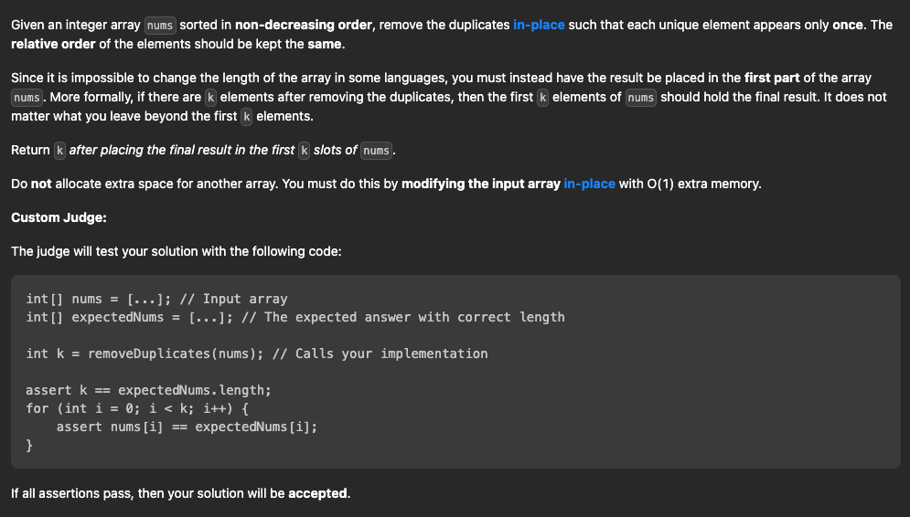

 LC26. Remove Duplicate Sorted Array

## 题目



## 分析

[具体分析](https://labuladong.github.io/algo/2/20/23/)

如果不是原地修改的话，我们直接 `new` 一个 `int[]` 数组，把去重之后的元素放进这个新数组中，然后返回这个新数组即可。

但是现在题目让你原地删除，不允许`new`新数组，只能在原数组上操作，然后返回一个长度，这样就可以通过返回的长度和原始数组得到我们去重后的元素有哪些了。

由于数组已经排序，所以重复的元素一定连在一起，找出它们并不难。但如果毎找到一个重复元素就立即原地删除它，由于数组中删除元素涉及数据搬移，整个时间复杂度是会达到 `O(N^2)`。

高效解决这道题就要用到快慢指针技巧：

我们让慢指针 `slow` 走在后面，快指针 `fast` 走在前面探路，找到一个不重复的元素就赋值给 `slow` 并让 `slow` 前进一步。

这样，就保证了 `nums[0..slow]` 都是无重复的元素，当 `fast` 指针遍历完整个数组 `nums` 后，`nums[0..slow]` 就是整个数组去重之后的结果。


## 代码

```js
/**
 * @param {number[]} nums
 * @return {number}
 */
// 双指针思路
// 一个指针指向当前的位置, 一个指针指向下一个位置

var removeDuplicates = function (nums) {
    if (nums.length == 0) {
        return 0;
    }
    let fastPointer = 1;
    let slowPointer = 0;
    // 只要fastPointer没有到达数组的末尾, 就一直循环
    while (fastPointer < nums.length) {
        let fastNumber = nums[fastPointer];
        let slowNumber = nums[slowPointer];
        // 如果fastNumber 和 slowNumber 不相等, 那么就把fastNumber的值赋值给slowPointer的下一个位置
        if (fastNumber !== slowNumber) {
            // 注意要先++, 在赋值
            slowPointer++;
            nums[slowPointer] = nums[fastPointer];
        }
        // 每次while循环 fastPointer都要++;
        fastPointer++;
    }
    // 这里注意slowPointer是从0开始的, 所以要+1
    return slowPointer + 1;
};
```
