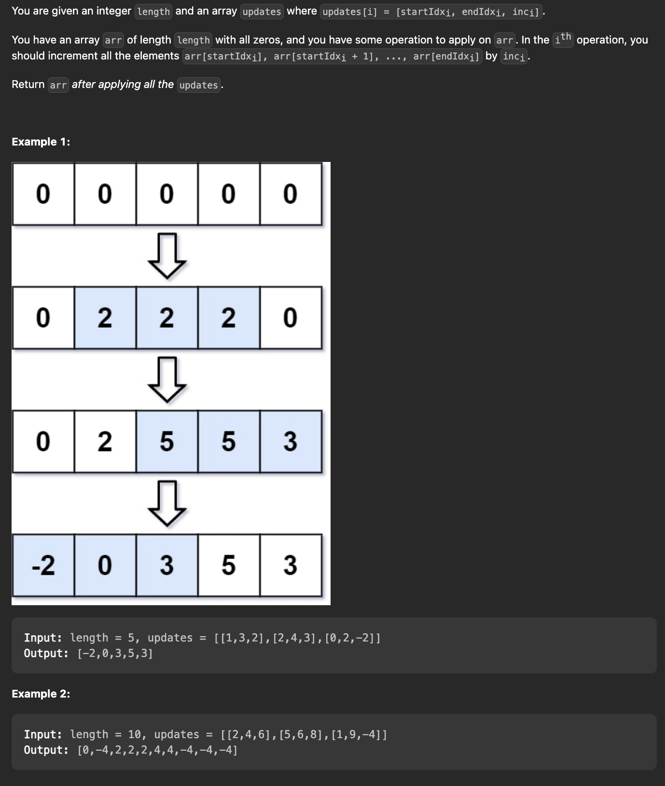
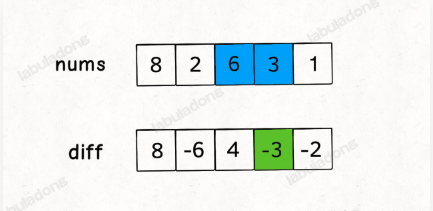
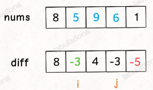

# 370. Range Addition

### 题目



### 分析



我们是可以通过方差反推出原始数组的nums

```js
let res = [];
res[0] = diff[0];
for(let i = 0; i < diff.length; i++){
    res[i] = res[i-1] + diff[i];
}

```

这样构造差分数组 diff，就可以快速进行区间增减的操作，如果你想对区间 nums[i..j] 的元素全部加 3，那么只需要让 diff[i] += 3，然后再让 diff[j+1] -= 3 即可：


### 代码

```js
/**
 * @param {number} length
 * @param {number[][]} updates
 * @return {number[]}
 */
let diff = [];
var getModifiedArray = function(length, updates) {
    diff =[];
    let array = new Array(length).fill(0);
    difference(array);
    for(let item=0; item <updates.length; item++){
        const eachUpdate = updates[item];
        const i = eachUpdate[0];
        const j= eachUpdate[1];
        const value = eachUpdate[2];
        increment(i,j,value);
    }

    return result();
};


// 获取diff数组
function difference(nums) {
    diff[0] = nums[0];
    for(let i=1; i<nums.length; i++){
        diff[i] = nums[i] - nums[i-1]; 
    }
}

// 数据每次的变化调用
function increment(i, j, val) {
    diff[i] += val;
    if(j+1<diff.length) {
        diff[j+1] -= val;
    }
}

// 获取最终的结果
function result (){
    let res = [];
    res[0] = diff[0];
    for (let i = 1; i < diff.length; i++) {
        res[i] = res[i-1] + diff[i];
    }
    return res;
}

```
