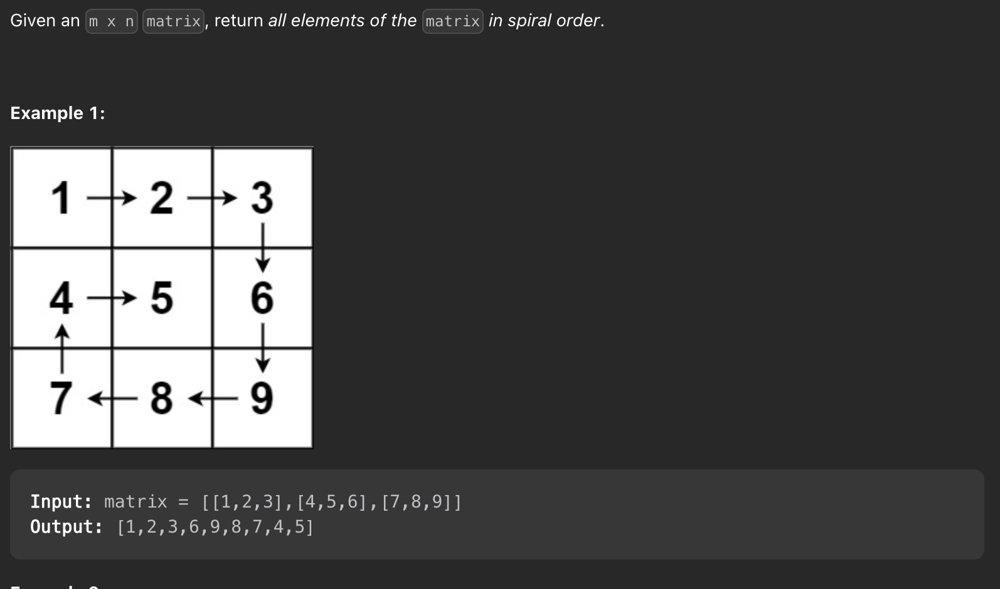

# 54 螺旋矩阵 Spiral Matrix

### title



### 分析

- 此类题目，不管是顺时针还是逆时针顺序输出，都可以把矩阵剥洋葱一样-，先循环一圈之后，里面的新的一圈又是一个小矩阵，以此类推直到矩阵只剩下一行
- 所以 设置四个哨兵位置 left top right bottom 分别把守 上下左右，循环的时候不能循环出界，该题目进行如下四次循环

1. top 最上一行
2. left 最左一列
3. bottom 最下一行
4. right 最右一列

重点: 循环推出条件，每次循环的时候都要判断 `top<= bottom`, `left <= right` 防止超出边界

### 代码

```js
function spiralOrder(matrix) {
    let rows = matrix.length;
    let cols = matrix[0].length;
    let res = [];

    // 我们确认当前正方形的边界

    let left = 0,
        right = cols - 1,
        top = 0,
        bottom = rows - 1;
    // 确保 top<=bottom, left<=right
    while (left <= right && top <= bottom) {
        // 剥洋葱, 上面一条边, 把上面边的所有元素都加入
        for (let i = left; i <= right && top <= bottom; i++) {
            res.push(matrix[top][i]);
        }
        top++;

        // 剥洋葱, 右边的边
        for (let i = top; i <= bottom && left <= right; i++) {
            res.add(matrix[i][right]);
        }
        right--;

        // 剥洋葱, 下面的边
        for (let i = right; i >= left && top <= bottom; i--) {
            res.add(matrix[bottom][i]);
        }
        bottom--;

        // 剥洋葱, 左边
        for (let i = bottom; i >= top && left <= right; i--) {
            res.add(matrix[i][left]);
        }
        left++;
    }

    return res;
}
```
