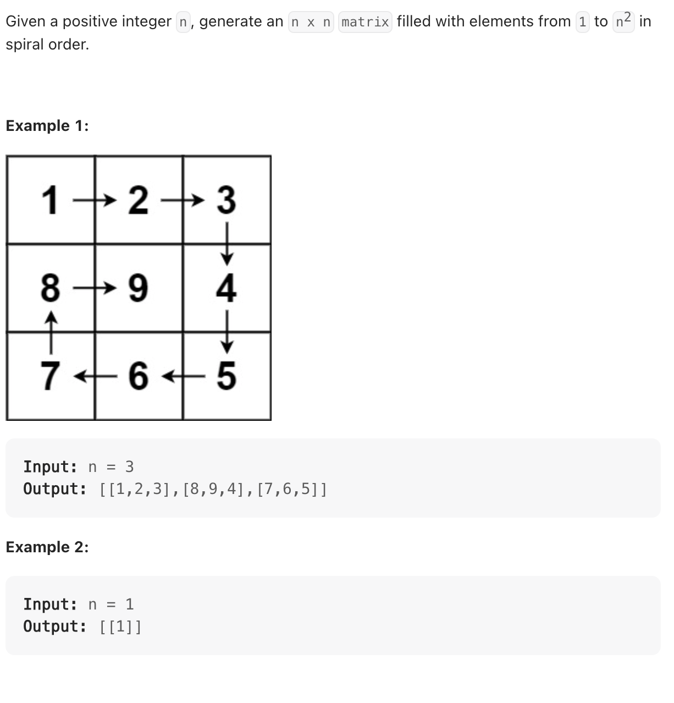

## Leetcode 59 螺旋矩阵 II / Spiral Matrix II

题目:


分析:
[视频链接](https://www.bilibili.com/video/BV1SL4y1N7mV/?vd_source=9f76d56358613adcb04ac66e71360895)

* 我们每个边的处理规则需要保持一致 (左闭右开) **循环不变量原则**
* 输入一个n, 那么我们要绕几圈呢(n/2). 如果是n是奇数, 那么向下取整, 同时二维矩阵中, 最中心的数字就是最后一个
* 填充上行从左到右
* 填充右列从上到下
* 填充下行从右到左
* 填充左列从下到上

代码:

```js
var generateMatrix = function(n) {
    let startX = startY = 0;   // 定义起始位置
    let loop = Math.floor(n/2);   // 旋转圈数
    let mid = Math.floor(n/2);    // 中间位置
    let offset = 1;    // 控制每一层填充元素个数
    let count = 1;     // 更新填充数字
    let res = new Array(n).fill(0).map(() => new Array(n).fill(0));
    let row, col;
    while (loop--) {
        row = startX;
        col = startY;
        // 上行从左到右（左闭右开）
        for (col = startY; col < n - offset; col++) {
            // 填充数字
            res[row][col] = count++;
        }
        // 右列从上到下（左闭右开）
        for (row = startX; row < n - offset; row++) {
            res[row][col] = count++;
        }
        // 下行从右到左（左闭右开）
        for (; col > startY; col--) {
            res[row][col] = count++;
        }
        // 左列做下到上（左闭右开）
        for (; row > startX; row--) {
            res[row][col] = count++;
        }

        // 从这开始完成了一圈数字填充
        // 更新起始位置  
        startX++;
        startY++;

        // 更新offset
        offset += 1;
    }
    // 如果n为奇数的话，需要单独给矩阵最中间的位置赋值
    if (n % 2 === 1) {
        res[mid][mid] = count;
    }
    return res;
};
  


```
