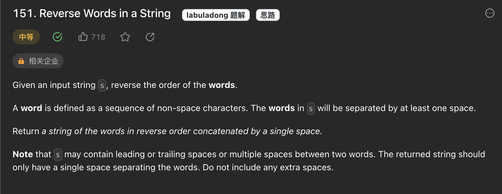

# 字符串的去空格+翻转



## 分析

第151题中, 我们需要先去除头和尾部的空格, 因此我们需要考虑的是如果先去掉头尾的空格, 然后整体翻转, 在根据单词之前的空格来分别翻转每个单词

## 代码

```js
var reverseWords = function (s) {
    // 字符串转成数组
    let strArr = Array.from(s);

    strArr = removeExtraSpace(strArr);
    reverse(strArr, 0, strArr.length - 1);
    let start = 0;
    for (let i = 0; i <= strArr.length; i++) {
        if (strArr[i] === ' ' || i === strArr.length) {
            reverse(strArr, start, i - 1);
            start = i + 1;
        }
    }
    return strArr.join('');
};

function removeExtraSpace(str_) {
    let res = [];
    for (let i = 0; i < str_.length; i++) {
        const charC = str_[i];
        
        if (charC !== ' ') {
            res.push(charC);
        } else {
            // 说明  charC 是 空格, 但是只保留以单词与单词之前的单个空格
            if (res.length && res[res.length - 1] !== ' ') {
                res.push(' ');
            }
        }
    }
    // 删除末尾空格
    if (res[res.length - 1] === ' ') {
        res.pop();
    }
    return res;
}

function reverse(arr, i, j) {
    while (i < j) {
        let temp = arr[i];
        arr[i] = arr[j];
        arr[j] = temp;
        i++;
        j--;
    }
}


```
